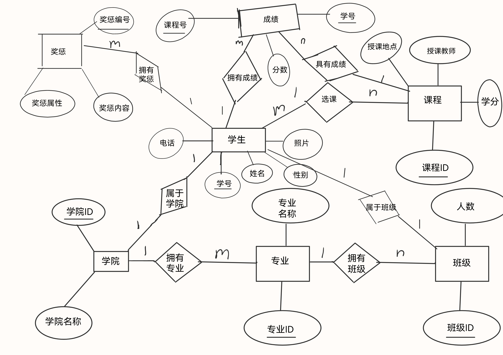

# DBMS Lab2 前期报告

PB21111683 孙宇萱

## 选题
学籍管理系统

## 需求分析
### 1.实体设计
学生（Student）:学生学号（PK），姓名，性别，学院（FK），专业（FK），行政班级（FK），证件照，联系电话。
学院（Department）：学院ID（PK），学院名称
专业（Major）：专业ID（PK），专业名称，学院ID（FK）
班级（Class）：班级ID（PK），人数，专业ID（FK），学院ID（FK）
课程（Course）：课程ID（PK），授课教师，授课地点，学分
成绩（Grade）：课程ID（PK），学生学号（PK），课程成绩。
奖惩（Awards_Punishment）；奖惩编号（PK），学生学号（FK），奖惩属性，奖惩内容

### 2.关系设计
一个学生只能有一个学院，专业，行政班级。学生可以由学号唯一确定，学生的姓名，性别，学院，专业，行政班级不能为空
学院，专业，班级，课程都由自身ID唯一确定。专业的从属学院，班级的人数，从属专业，从属学院，课程的授课教师，授课地点，学分不能为空。
成绩由学生学号和课程唯一确定，成绩不能为空。
奖惩由奖惩编号唯一确定，奖惩中的学生学号，从属学院，从属专业，从属班级，奖惩属性，奖惩内容不能为空。

### 3.功能设计
登录界面功能。
学生信息管理：学生信息的增删改查。
选课系统：学生可以选课，退课，换课，放弃成绩。
课程信息管理：课程信息的增删改查。
成绩信息管理：成绩信息的增删改查。
奖惩信息管理：奖惩信息的增删改查。
专业变更管理：学生可以更换专业。
学院/专业/班级信息管理：学院/专业/班级信息的增删改查。

## E-R图

